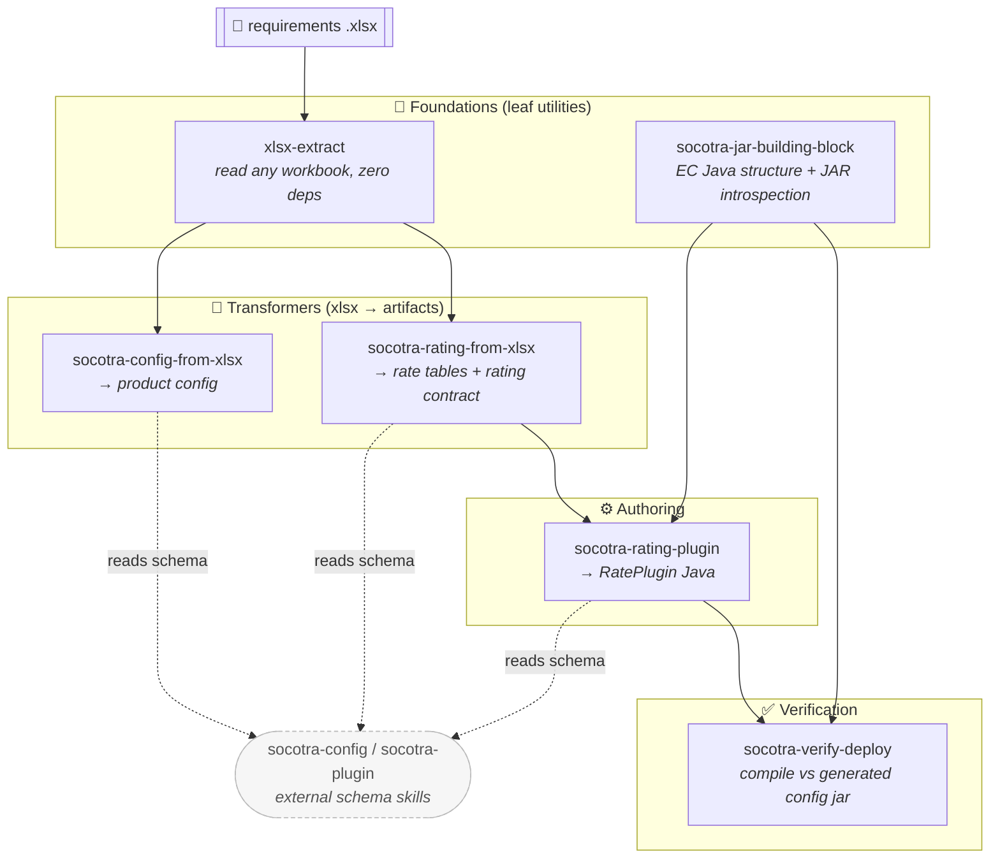

# Socotra Config Toolkit

A Claude Code plugin that bundles six interlocking [Agent Skills](https://code.claude.com/docs/en/skills) for building on **Socotra Enterprise Core (EC)** — from a business‑requirements spreadsheet all the way to verified, deployable Java plugins.

The skills are deliberately small and **soft‑coupled**: none of them `import` another. Instead each one *names* the skills it hands off to (in its description and body), so Claude knows when to chain them. You can invoke any single skill on its own, or let Claude walk the whole pipeline.

## Install

```text
/plugin marketplace add joshlawrence-web/socotra-config-toolkit
/plugin install socotra-config-toolkit@socotra
```

Replace `joshlawrence-web/socotra-config-toolkit` with your own `owner/repo` if you fork it. The first command registers this repository as a plugin marketplace; the second installs the bundled plugin. Run `/plugin` to confirm the skills loaded.

CLI equivalent:

```bash
claude plugin marketplace add joshlawrence-web/socotra-config-toolkit
claude plugin install socotra-config-toolkit@socotra
```

## The pipeline at a glance



Read it in layers: **read** the spreadsheet → **transform** it into config + rate tables → **author** the Java plugin → **verify** it compiles before you ever touch a tenant. Dashed edges are *soft* references to schema skills that live in a different plugin (see [Companions](#companions)).

## How the skills soft‑interact

"Soft‑interact" means a skill mentions another by name so Claude chains to it — there are no hard imports, and every skill still works standalone.

| Skill | Hands off to | Leans on (reads only) |
| --- | --- | --- |
| `xlsx-extract` | — *(leaf; everything reading a workbook starts here)* | — |
| `socotra-jar-building-block` | — *(foundation for the Java skills)* | — |
| `socotra-config-from-xlsx` | — | `xlsx-extract`, external `socotra-config` |
| `socotra-rating-from-xlsx` | `socotra-rating-plugin`, `socotra-verify-deploy` | `xlsx-extract`, external `socotra-config` |
| `socotra-rating-plugin` | `socotra-verify-deploy` | `socotra-jar-building-block`, external `socotra-config` |
| `socotra-verify-deploy` | — *(terminal check)* | `socotra-jar-building-block`, external `socotra-config` |

Two skills are **foundations** that nothing depends on upward — `xlsx-extract` (all file reading) and `socotra-jar-building-block` (all EC Java work). `socotra-verify-deploy` is the **terminal** step everything funnels into. The two `*-from-xlsx` skills are the **entry points** for a fresh requirements workbook.

### Worked example — full chain

> *"Here's the CGL requirements workbook — build me the config, the rater, and make sure it compiles."*

1. `socotra-config-from-xlsx` calls `xlsx-extract` to read the tabs, then emits a `socotra-config/` tree (shape governed by the external `socotra-config` schema).
2. `socotra-rating-from-xlsx` reads the rating tabs and produces rate‑table CSVs + an auditable rating contract.
3. `socotra-rating-plugin` turns that contract into a valid `RatePlugin`, using `socotra-jar-building-block` to get the signatures and overloads right.
4. `socotra-verify-deploy` compiles the plugin against the generated `customer-config.jar` — errors caught locally, no tenant round‑trip.

Or skip straight to any step: ask only for "extract this spreadsheet" and just `xlsx-extract` runs.

## Skills

Invoke explicitly as `/socotra-config-toolkit:<skill>`, or let Claude pick them automatically.

| Skill | What it does |
| --- | --- |
| `xlsx-extract` | Stdlib‑only `.xlsx` parser — dumps cells/sheets/comments to text/csv/json. No openpyxl or pandas. |
| `socotra-config-from-xlsx` | Maps a "Config Template" workbook → a deployable `socotra-config` (entities + transform rules that pass `validateConfig`). |
| `socotra-rating-from-xlsx` | Turns a filled "Rating workbook" → rate‑table CSVs + an auditable rating contract for the active config. |
| `socotra-jar-building-block` | Foundation: EC Java structure (coremodel, `DataFetcher`, generated customer package, plugin dispatch) + `javap` JAR introspection. |
| `socotra-rating-plugin` | Builds a valid `RatePlugin` for the active config — legal charges per element, `.rate()` vs `.amount()`, rate‑table lookups. |
| `socotra-verify-deploy` | Compiles plugin Java against the generated `customer-config.jar` locally to catch errors before a tenant round‑trip. |

## Companions

These skills reference, but do **not** bundle, two schema‑authority skills that ship in Socotra's `socotra-configuration` plugin:

- **`socotra-config`** — the authoritative per‑entity JSON schema for product configs. The `*-from-xlsx` and `socotra-rating-plugin` skills defer to it for shape rather than restating it.
- **`socotra-plugin`** — Java plugin templates and SDK setup.

The toolkit degrades gracefully without them (it just can't lean on the canonical schema), but installing both gives Claude the complete picture.

## Repository layout

```
.
├── .claude-plugin/
│   ├── plugin.json          # plugin manifest (name, version, skills path)
│   └── marketplace.json     # marketplace listing — this repo hosts one plugin
├── skills/
│   ├── xlsx-extract/             # foundation: file reading
│   ├── socotra-jar-building-block/  # foundation: EC Java + JAR introspection
│   ├── socotra-config-from-xlsx/    # entry: workbook → config
│   ├── socotra-rating-from-xlsx/    # entry: workbook → rate tables
│   ├── socotra-rating-plugin/       # authoring: RatePlugin Java
│   └── socotra-verify-deploy/       # terminal: local compile check
├── README.md
└── LICENSE
```

Each skill directory carries its own `SKILL.md` plus any `scripts/`, `references/`, and `examples/` it needs — self‑contained, so they keep working if moved.

## License

MIT — see [LICENSE](LICENSE).
